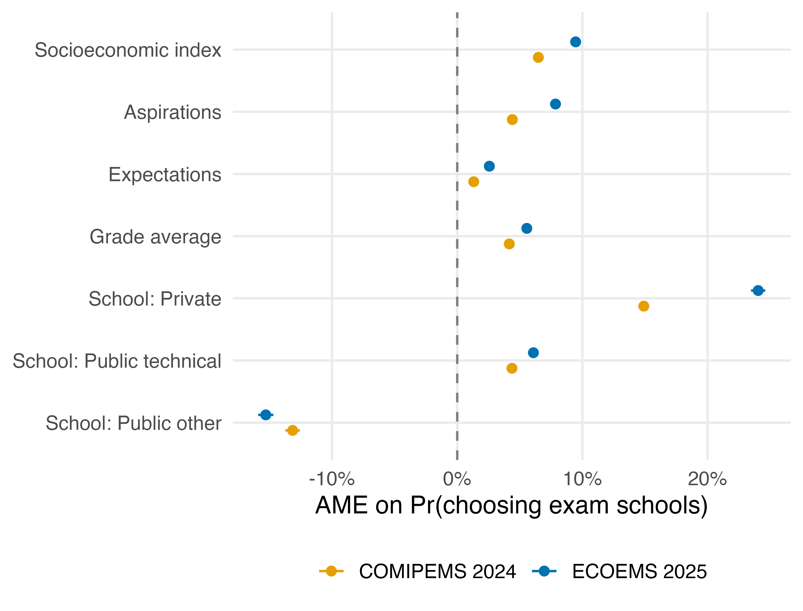
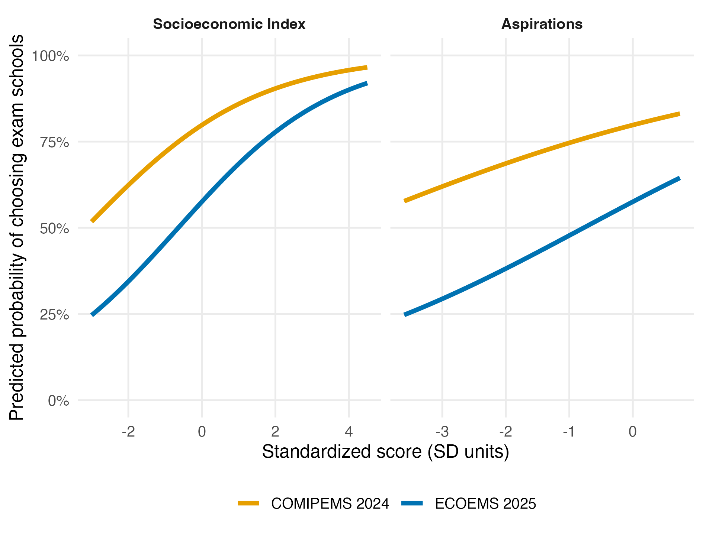
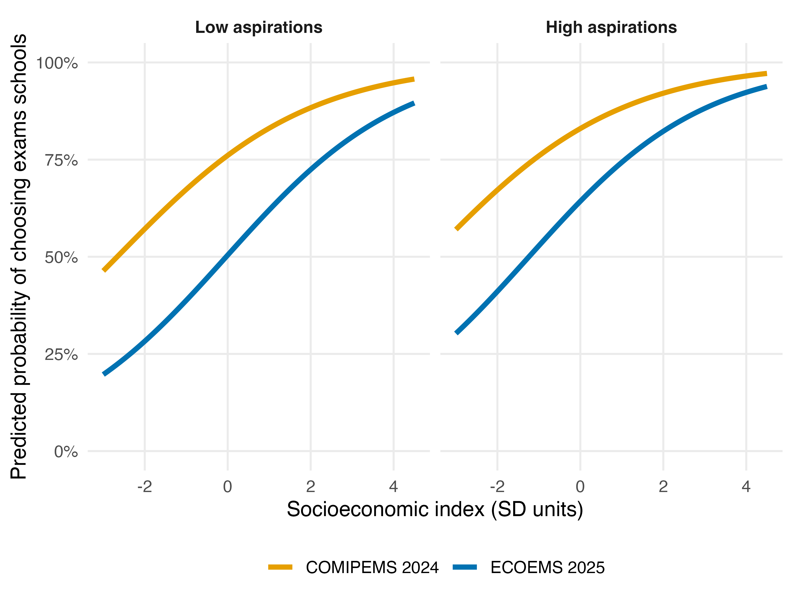

#### Abstract

In 2025, the admission system for public upper secondary education in Mexico City was
reformed, intending to end the use of the standardized test used to assign students to
schools and replace it with a lottery. However, because the most selective high schools
refused to abandon the exam, the reform resulted in a two-track system: a lottery for
most schools and an exam for the most selective ones. While the reform aimed to
increase equality of opportunity in the transition to upper secondary schooling, its impact
is uncertain, as the two-track system increased differences in applying to each segment
of schools in a context already characterized by institutional heterogeneity and social
segmentation in access to the most selective high schools.

Using rich administrative data and logistic regression, this thesis analyses how the
change in the admissions system affected the relationship between an applicant’s social
origins and educational characteristics and their decision to apply to the schools that
require an exam. It finds that under the new system, the share of applicants choosing
exam schools decreased from 78.6% to 59.2%. This drop was driven by a strengthening
of the link between applicants' social origins and educational characteristics and their
choice of exam-requirement schools, as these variables became stronger predictors in
the new system. These findings highlight the difficulty of isolating the admissions reform,
in its attempt to increase equality of opportunity, from the broader inequalities it operates
within. They also show how the design of educational systems closely interacts with the
dynamics of social inequality, pointing to the need to address heterogeneity among
schools and the factors that result in differences in students' social and educational
characteristics, as necessary steps to increase equality of opportunity in the transition to
upper secondary schooling.

#### Introduction

Filing into a school early in the morning, surrounded by thousands of other young
people, to take an exam and then going home to nervously await its results had become
a rite of passage for those applying to public secondary education in Mexico City. That
changed in 2025, when the federal government announced it would stop using the test
that had been used to distribute applicants among high schools since 1996. The exam,
according to the government’s argument, presented itself as a fair competition, but
obscured how differences in its results reflected applicants' disparities in
socioeconomic origins rather than abilities or effort. In their view, the exam legitimized
social inequality, rather than neutralizing it. The test was replaced with a lottery, a
change that was presented as more than a policy modification. It was described as a
philosophical reorientation from meritocracy to undifferentiated access, meant to
distribute the chances of admission more evenly across applicants regardless of their
origins, rather than consistently rewarding those who were already advantaged.

Although the reform intended to stop the use of the exam altogether, it did not achieve
its goal. After the National University (UNAM) and the National Polytechnic Institute
(IPN) pushed to retain the exam, the result was a hybrid admissions system. It mixes a
lottery track for most schools with an exam track for the UNAM and IPN schools, which
are by far the most selective institutions. Which track an applicant entered was
determined by the schools they applied to. Applicants who included any UNAM or IPN
school in their school selection had to prepare for and sit the exam, competing for
admission based on their results. Those who applied only to the other schools simply
entered the lottery and waited for the draw. The reform had set out to eliminate the
exam, but instead, it made opting into it a deliberate decision linked to school choice.

The transition to upper secondary education in Mexico City is shaped by a combination
of heterogeneous schools and applicants from highly unequal social origins, which
under the old system resulted in social segmentation of students among schools
(Blanco, 2014; Cobos Marin, 2023; Rodríguez Rocha, 2015; Solís, 2013). By focusing on
how the new public admissions system affected applicants’ school selection, this
thesis analyzes how the introduction of the new two-track admissions system altered
the relationship between applicants' social origins and educational characteristics and
their school choice behavior.

After the change in admissions systems, the share of applicants choosing exam
schools decreased from 78.6% in 2024 to 59.2% in 2025. This drop was driven by a
strengthening of the link between applicants' socioeconomic and educational
characteristics and their choice of exam-requirement schools, as these became
stronger predictors in the new system. The decline in the choice of exam schools was
concentrated among those with lower socioeconomic origins and weaker educational
aspirations to reach higher levels of schooling. Among them, the probability of selecting
exam-requirement schools dropped from 57.1% to 28.2%, compared to a decline from
96.5% to 92.3% among high-socioeconomic and high aspiration applicants.

The introduction of the two tracks in the admissions system changed the conditions
under which applicants decide which schools to apply to. The drop in applicants
selecting exam-requirement schools reflects how applicants’ school choices became
even more bound up with calculations about the costs and likely outcomes of the
admissions tracks, each representing a different logic of accessing opportunities: merit
in the exam and chance in the lottery. Those deliberations led applicants in different
social positions to apply to dissimilar schools, as part of their strategies to secure
access to one of their preferred schools. Motivated by a philosophical shift from
meritocratic competition to undifferentiated access, the reform intended to decrease
the weight of applicants’ social origins on their trajectory. However, the unintended
introduction of two-track, exam- and lottery-based mechanisms led to more
pronounced social segmentation in school choices than existed under the previous
system.

This thesis contributes to research on inequality of opportunity in the transition to
upper secondary education, and to questions about how the design of admissions
institutions interacts with the role of social origin in educational trajectories. By
highlighting the difficulty of isolating the admissions reform from the broader social and
educational inequalities it operates within, its findings point to the obstacles in
translating views of fairness in education into equality of opportunity. At the same time,
it supports previous studies that show how the design of educational systems shapes,
rather than merely reflects, the dynamics of social inequalities. As necessary steps to
increase equality of opportunity in the transition to upper secondary schooling, it
points to the importance of addressing heterogeneity among schools and the factors
that result in differences in students' social and educational characteristics.

This thesis is organized in six sections. Section 2 reviews research on educational
inequality, specifically in upper secondary schooling in Mexico City. Section 3 provides
an overview of education in Mexico and of the changes to Mexico City’s admission
system. Section 4 describes the data sources and methodology underpinning the
results presented in Section 5. Finally, Section 6 synthesizes those results and
concludes by outlining its theoretical and policy implications around social inequality
in educational trajectories.

#### Results

##### Average marginal effect (AME) on the probability of choosing exam schools

Note: Reference category for school type is public general. Confidence intervals at 99%.

##### Predicted probability of choosing exam schools across the range of SES and Aspirations, by cohort.

Note: Other variables held at public general school, mean grade average, mean aspirations, and mean expectations. 

##### Predicted probability of choosing exam schools by SES conditioned by low and high aspirations, by cohort.

Note: Other variables held at public general school, mean grade average, and mean expectations. SD range is bounded to exclude extreme values. 

